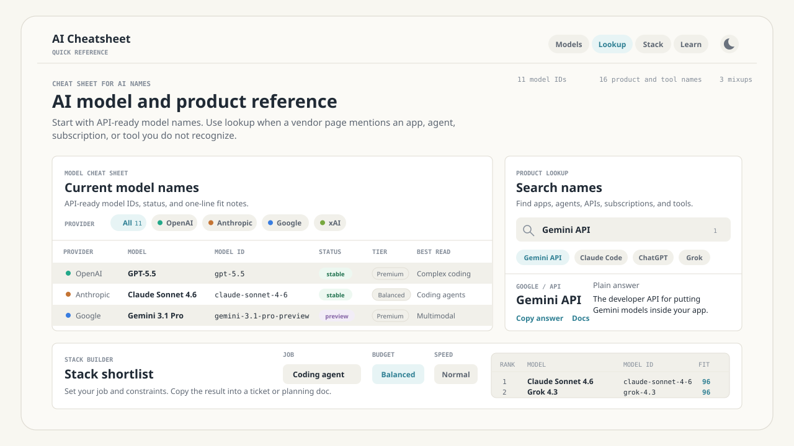

# AI Cheatsheet

<p align="center">
  
</p>

<p align="center">
  <a href="https://github.com/ozansozuozgit/model-clarity/actions/workflows/ci.yml"></a>
  <a href="https://github.com/ozansozuozgit/model-clarity/actions/workflows/update-catalog.yml"></a>
  
</p>

AI Cheatsheet is a source-backed reference for AI product names, model IDs, and the stacks people mean when they say things like Gemini, Claude, ChatGPT, Grok, API, agent, or coding tool.

It is built to answer one practical question fast: **what is this AI thing, and when should I use it?**

## What It Does

- Search confusing app, API, agent, subscription, tool, and model names.
- Copy API-ready model IDs with provider, status, context, tier, latency, and docs.
- Compare model fits for coding agents, RAG/search, realtime voice, batch work, workspace automation, and multimodal analysis.
- Explain common naming traps such as app surface versus API surface.
- Keep catalog claims tied to source URLs and `lastVerified` dates.

## Product Tour

<p align="center">
  
</p>

The app has three main surfaces:

- **Current model names**: API-ready model IDs grouped by provider.
- **Product lookup**: plain-English definitions for apps, APIs, agents, subscriptions, platforms, and tools.
- **Stack shortlist**: a small recommendation helper based on use case, budget, latency, ecosystem, and self-hosting needs.

## Quick Start

```bash
npm ci
npm run dev
```

Open [http://localhost:3000](http://localhost:3000).

## Scripts

```bash
npm run dev
npm run build
npm run start
npm run typecheck
npm run catalog:update
npm run catalog:validate
```

## Catalog Data

The app reads static JSON from [data/catalog](data/catalog):

- `providers.json`
- `products.json`
- `models.json`
- `changelog.json`
- `confusions.json`
- `glossary.json`

[src/lib/catalog.ts](src/lib/catalog.ts) owns the TypeScript types, JSON imports, and recommendation logic.

## Keeping The Catalog Fresh

Catalog updates are intentionally source-backed and reviewable.

```bash
npm run catalog:update
npm run catalog:validate
```

`catalog:update` fetches official provider model sources, reconciles known records, and writes a review receipt to `reports/catalog-diff.md`.

For open-source CI, the updater can run without private secrets. It currently uses Anthropic's public model docs as a fallback, so releases such as Claude Opus 4.8 can be detected even when `ANTHROPIC_API_KEY` is not set.

Optional provider keys improve coverage:

| Variable | Used for |
| --- | --- |
| `OPENAI_API_KEY` | OpenAI `/v1/models` |
| `ANTHROPIC_API_KEY` | Anthropic `/v1/models` |
| `GEMINI_API_KEY` | Gemini `models.list` |
| `XAI_API_KEY` | xAI model endpoints |

The scheduled workflow in [.github/workflows/update-catalog.yml](.github/workflows/update-catalog.yml) runs every Monday and can also be started manually. If catalog files change, it opens or updates a `codex/catalog-auto-update` pull request.

The CI workflow in [.github/workflows/ci.yml](.github/workflows/ci.yml) runs catalog validation, TypeScript, and a production build on pushes and pull requests.

## Environment

Copy the example file when you want local provider refreshes:

```bash
cp .env.example .env
```

`NEXT_PUBLIC_SITE_URL` controls production metadata. Provider API keys are optional for local development.

## Validation Rules

`npm run catalog:validate` checks:

- required fields and enum values
- duplicate IDs
- provider relationships
- source URL shape and reachability
- stale `lastVerified` dates

Set `CATALOG_VALIDATE_URLS=0` for offline local validation.

## Deploy

This is a static Next.js app and deploys cleanly to Vercel.

1. Import the public GitHub repo in Vercel.
2. Set `NEXT_PUBLIC_SITE_URL` to your production URL.
3. Deploy from `main`.

## Contributing

Catalog changes should include source URLs and pass:

```bash
npm run catalog:validate
npm run typecheck
npm run build
```

For new models, prefer official provider docs or APIs over third-party summaries. If automation lists a model as a candidate, add the plain-English guidance manually before merging.

## License

MIT. See [LICENSE](LICENSE).
